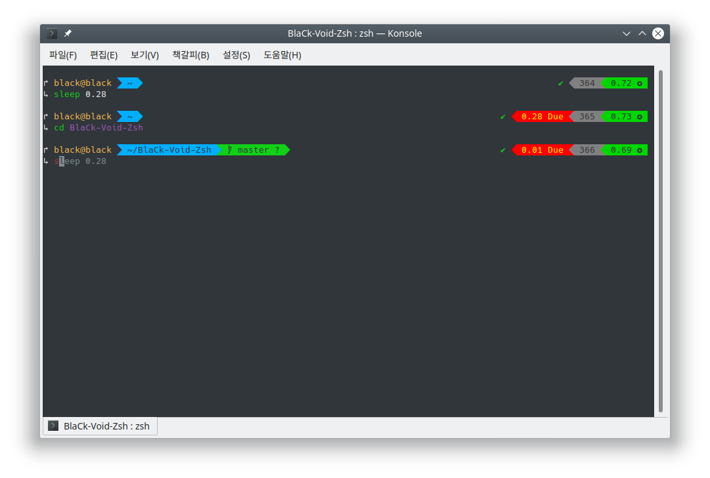

 
# BlaCk Void Zsh

Awesome Zsh Setting.

Tested on Kubuntu 18.04

<!-- markdown-toc start - Don't edit this section. Run M-x markdown-toc-refresh-toc -->
**Table of Contents**

- [BlaCk Void Zsh](#black-void-zsh)
    - [Apply](#apply)
        - [Ubuntu](#ubuntu)
        - [Others](#others)
    - [Theme](#theme)
    - [Plugins](#plugins)

<!-- markdown-toc end -->


* Preview



## Apply

### Ubuntu

``` shell
git clone https://github.com/black7375/BlaCk-Void-Zsh.git ~/
bash ~/BlaCk-Void-Zsh/BlaCk-Void-Zsh.sh
```

`

### Others

Requirements

* zsh, powerline, thefuck(`pip3 install thefuck`)

Install

* Git Clone

`git clone https://github.com/black7375/BlaCk-Void-Zsh.git ~/ && cd BlaCk-Void-Zsh`
 
* antigen

`curl -L git.io/antigen > antigen.zsh`

* nerdfont

``` shell
git clone https://github.com/ryanoasis/nerd-fonts.git
cd nerd-fonts && ./install.sh
cd ..
```

`

* copy .zshrc

  `cp -v BlaCk-Void.zshrc  ~/.zshrc`

* Zsh Shell Set

  `sudo chsh -s /usr/bin/zsh`

## Theme

* [Powerlevel9k](https://github.com/bhilburn/powerlevel9k)

## Plugins

Plugin Manager

* [Antigen](https://github.com/zsh-users/antigen)

Default Repo

* Git
* Heroku
* Pip
* Lein
* Command Not Found


Custom Repo

* [Zsh 256 Color](https://github.com/chrissicool/zsh-256color)
* [Alias Tips](https://github.com/djui/alias-tips)
* [Zsh Autosuggestions](https://github.com/zsh-users/zsh-autosuggestions)
* [Zsh Autopair](https://github.com/hlissner/zsh-autopair)
* [Autoupdate Antigen](https://github.com/unixorn/autoupdate-antigen.zshplugin)
* [Zsh Completions](https://github.com/zsh-users/zsh-completions)
* [Enhancd](https://github.com/b4b4r07/enhancd)
* [Fast Syntax Highlighting](https://github.com/zdharma/fast-syntax-highlighting)
* [Forgit](https://github.com/wfxr/forgit)
* [Fzf Widgets](https://github.com/ytet5uy4/fzf-widgets)
* [Zsh Git Smart Commands](https://github.com/seletskiy/zsh-git-smart-commands)
* [k](https://github.com/supercrabtree/k)
